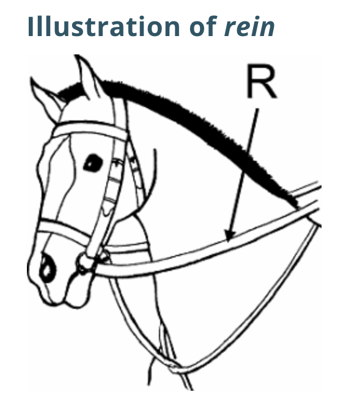

<h1>disrupt</h1>

- 崩壊させる、粉砕する、破裂させる、(一時的に)混乱させる
- disrupted; disrupting; disrupts
- **Synonyms**: break, break up, bust, fracture
- The barking dogs disrupted my sleep.
- The weather disrupted our travel plans.
- [weblio](https://ejje.weblio.jp/content/disrupt)
- [webster](https://www.merriam-webster.com/dictionary/disrupt#other-words)
- [Cambridge](https://dictionary.cambridge.org/us/dictionary/english/disrupt)

|  meanings | synonyms  | 
|---|---|
|  他人の活動に口出しする   interfere in someone else's activity|  interrupt, disrupt | 
|  めちゃくちゃにする   throw into disorder|  disrupt |
|  絶え間を作る  make a break in| cut off, interrupt, break up, disrupt  |

#windfall <small>(n)</small>
- 意外な授かり物、たなぼた
- something (such as a tree or fruit) blown down by the wind
- an unexpected, unearned, or sudden gain or advantage
- an amount of money that you win or receive from someone unexpectedly
- **Synonyms** - benediction, benefit(利益), blessing(神からの)恩恵), godsend(思いがけない幸運)
 - They received a windfall because of the tax cuts.
 - hitting the lottery jackpot was an incredible windfall for the recently laid-off worker
- [cambridge](https://dictionary.cambridge.org/us/dictionary/english/windfall)
- [weblio](https://ejje.weblio.jp/content/windfall)

#Spur <small>(v)</small>
- /spɜr/ 
- 〔馬に〕拍車を掛ける
- ～を刺激する、～を促進させる、～を励ます
- to encourage an activity or development, or to cause something to develop faster:
- The reward spurred them to work harder.
- Lower interest rates should spur economic growth.
- He spurred the horse onward.
- goad(あおり立てる), prod(～するように〕駆り立てる、促す)
- [weblio](https://ejje.weblio.jp/content/spur)
- [cambridge](https://dictionary.cambridge.org/us/dictionary/english/spur)
- [webster](https://www.merriam-webster.com/dictionary/spur#synonyms)

#defuse <small>(v)</small>
- 危険など取り除く、鎮める
- defused; defusing; defuses
- to make a difficult or dangerous situation calmer:
- defuse the conflict
- Skilled negotiators helped defuse the crisis.
- The two groups are trying to defuse tensions in the town council over the budget.
- [cambridge](https://dictionary.cambridge.org/us/dictionary/english/defuse)
- [weblio](https://ejje.weblio.jp/english-thesaurus/content/defuse)
- [webster](https://www.merriam-webster.com/dictionary/defuse#examples)

#rein <small>(v)</small>

- 〔馬具の〕手綱 (n)
- 〔人やものに対する〕統制力(n)
- 〔手綱などで〕～を止める［阻止する］
- ～を統制［制御］する
- reined; reining; reins
- power and control of a business or other activity:
- rein in Syria
- Turkish president wants Moscow to rein in Syrian regime’s offensive 
- These are the councillors who hold the reins of power.
- He handed the reins to his successor.

