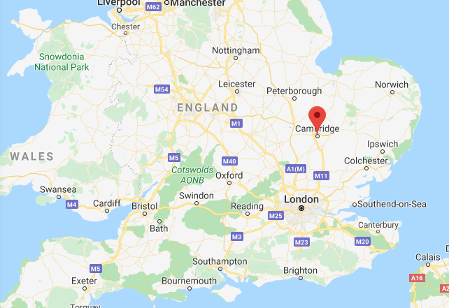

# TOEIC Practice Test

- Jan 25, 2020 at Culver City library
- 10:25 am - 12:25 pm
- Results: **800-940**
- \*Marked wrong options: (-2)

| Section | Errors |
| ------- | ------ |
| Part 1  | 2      |
| Part 2  | 4      |
| Part 3  | 4      |
| Part 4  | 3      |
| Part 5  | 2      |
| Part 6  | 3      |
| Part 7  | 8      |

<h1>take a stroll </h1>

- 散歩する
  

<h1>Would you like to~ </h1>

- would you like to use our computer while you wait for Mr. Fuller?
    

<h1>dehydrator</h1>

- 乾燥機、脱水機
  

<h1>analytics<small>(n)</small></h1>

- 分析論
- YouTube Analytics (ユーチューブ［YouTube］アナリティクス)
- big data analytics company
- Strategy Analytics
  

<h1>analysis<small>(n)</small></h1>

- 分析
  

<h1>analyze <small>(v)</small></h1>

- analyze, analyzed, analyzed, analyzes
- 分析する

  

<h1>exclusive <small>(a)</small></h1>

- 分け合わない, **独占する**
- I have exclusive rights to manufacture the product.
- その製品の製造に関わる独占権を獲得した
- **高級な、富裕層向けの**
- Many exclusive stores are found within walking distance of all major hotels.
- どの一流ホテルからも、歩いて行ける距離に多くの高級店舗がある
  

<h1>general public</h1>

- 一般大衆
- Attendees will have exclusive use of the venue.

  

<h1>distinctive <small>(a)</small></h1>

- 独特の
- 典型的な、代表となる
- distinctive ability (際立った才能)
  

### Country Name

- Cambridge

