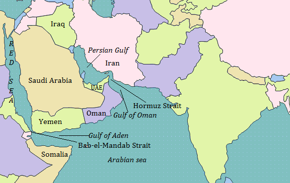
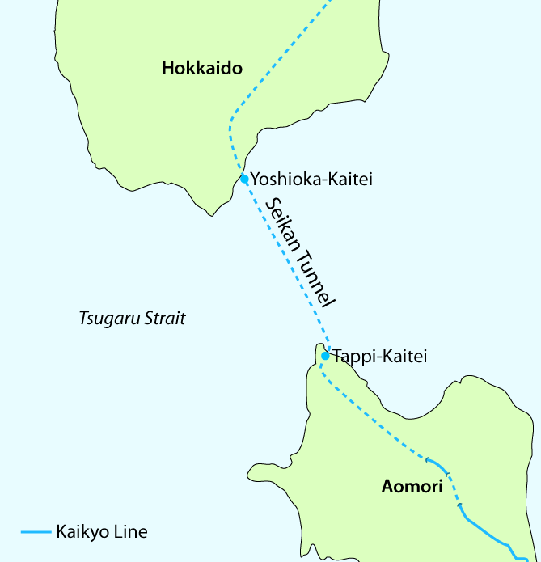
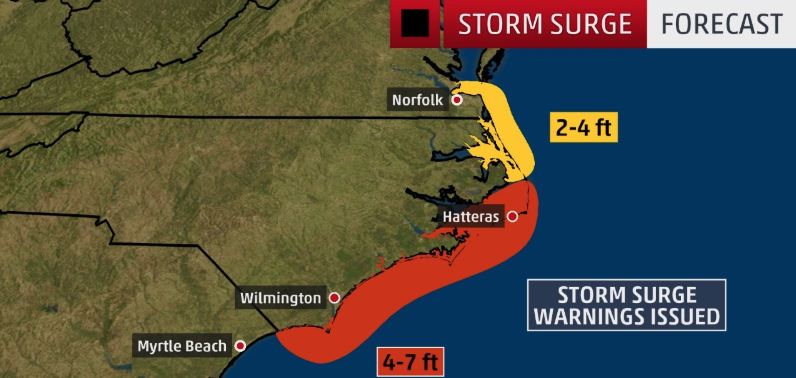

<h1>disrupt <small>(v)</small></h1>

- 崩壊させる、粉砕する、破裂させる、(一時的に)混乱させる
- disrupted; disrupting; disrupts
- **Synonyms**: break, break up, bust, fracture
- The barking dogs disrupted my sleep.
- The weather disrupted our travel plans.
- [weblio](https://ejje.weblio.jp/content/disrupt)
- [webster](https://www.merriam-webster.com/dictionary/disrupt#other-words)
- [Cambridge](https://dictionary.cambridge.org/us/dictionary/english/disrupt)

|  meanings | synonyms  | 
|---|---|
|  他人の活動に口出しする   interfere in someone else's activity|  interrupt, disrupt | 
|  めちゃくちゃにする   throw into disorder|  disrupt |
|  絶え間を作る  make a break in| cut off, interrupt, break up, disrupt  |

<h1>windfall <small>(n)</small></h1>

- 意外な授かり物、たなぼた
- something (such as a tree or fruit) blown down by the wind
- an unexpected, unearned, or sudden gain or advantage
- an amount of money that you win or receive from someone unexpectedly
- **Synonyms** - benediction, benefit(利益), blessing(神からの)恩恵), godsend(思いがけない幸運)
  >They received a windfall because of the tax cuts.
  >hitting the lottery jackpot was an incredible windfall for the recently laid-off worker
- [cambridge](https://dictionary.cambridge.org/us/dictionary/english/windfall)
- [weblio](https://ejje.weblio.jp/content/windfall)

<h1>Spur <small>(v)</small></h1>

- /spɜr/ 
- 〔馬に〕拍車を掛ける
- ～を刺激する、～を促進させる、～を励ます
- to encourage an activity or development, or to cause something to develop faster:
	 >The reward spurred them to work harder.
  >Lower interest rates should spur economic growth.
- He spurred the horse onward.
- goad(あおり立てる), prod(～するように〕駆り立てる、促す)
- [weblio](https://ejje.weblio.jp/content/spur)
- [cambridge](https://dictionary.cambridge.org/us/dictionary/english/spur)
- [webster](https://www.merriam-webster.com/dictionary/spur#synonyms)

<h1>defuse <small>(v)</small></h1>

- 危険など取り除く、鎮める
- defused; defusing; defuses
- to make a difficult or dangerous situation calmer:
- defuse the conflict
- Skilled negotiators helped defuse the crisis.
- The two groups are trying to defuse tensions in the town council over the budget.
- [cambridge](https://dictionary.cambridge.org/us/dictionary/english/defuse)
- [weblio](https://ejje.weblio.jp/english-thesaurus/content/defuse)
- [webster](https://www.merriam-webster.com/dictionary/defuse#examples)

<h1>rein <small>(v)</small></h1>

- 〔馬具の〕手綱 (n)
- 〔人やものに対する〕統制力(n)
- 〔手綱などで〕～を止める［阻止する］
- ～を統制［制御］する
- reined; reining; reins
- power and control of a business or other activity:
- rein in Syria
- Turkish president wants Moscow to rein in Syrian regime’s offensive 
- These are the councillors who hold the reins of power.
- He handed the reins to his successor.

<h1>underpin <small>(v)</small></h1>

- 下につっかいをする、土台を補強する、支持する、実証する
- underpinned; underpinning; underpins
- SUPPORT, SUBSTANTIATE
- underpin a thesis with evidence
- underpin a structure
- underpin a sagging building
- bear, support, sustain,
- Big-Tech Stocks Underpin Market's Ascent

|  meanings | synonyms  | 
|---|---|
|  下からのサポート   support from beneath|  underpin | 
|  証拠または出典で根拠を挙げ より確証を示すまたは確認する   support with evidence or authority or make more certain or confirm|  bear out(実証する、証明する)|

<h1>propel <small>(v)</small></h1>

- pro·​pel | \ prə-ˈpel  \
- propelled; propelling
- ～を駆り立てる、～を推進する
- to cause something to move forward:
- drive, push
- [weblio](https://ejje.weblio.jp/content/propel)
- [alc](https://eow.alc.co.jp/search?q=propel)
- [cambridge](https://dictionary.cambridge.org/us/dictionary/english/propel)
- [webster](https://www.merriam-webster.com/dictionary/propel#synonyms)

<h1>intensify <small>(v)</small></h1>

- 増大させる、増強させる
- 増大する、強化する
- intensified; intensifying
- to make intense or more intensive : STRENGTHEN
- https://ejje.weblio.jp/content/intensify
https://eow.alc.co.jp/search?q=intensify

<h1>strengthen <small>(v)</small></h1>

- strength·​en | \ ˈstreŋ(k)-thən
- 強くする、丈夫にする、増強する
- strengthened; strengthening
- to make stronger
- to become stronger
- These exercises will strengthen your stomach muscles.
- He takes herbs to strengthen his immune system.
- He intensified his training, running 45 miles a week.
- [webster](https://www.merriam-webster.com/dictionary/strengthen#synonyms)
- [cambridge](https://dictionary.cambridge.org/us/dictionary/english/intensify)
- [webster](https://www.merriam-webster.com/dictionary/intensify#synonyms)
- [weblio](https://ejje.weblio.jp/content/intensify)

<h1>extradition <small>(n)</small></h1>

- (ある国に逃げ込んだ)外国犯人の引き渡し
- the return of someone accused of a crime to the country where the crime was committed:
- The demonstrators want the full withdrawal of an extradition bill.
  

<h1>ascent</h1>

- \ ə-ˈsent
- 登り、上昇、向上、昇進
 - They followed a steep ascent to the top of the hill.
 - our plane broke through some heavy low clouds during its ascent and leveled off once we were above them
 - Big-Tech stocks underpin Market's Acent
- [weblio](https://ejje.weblio.jp/content/ascent)
- [alc](https://eow.alc.co.jp/search?q=ascent)
- [webster](https://www.merriam-webster.com/dictionary/ascent)

<h1>predatory <small>(a)</small></h1>

- \ ˈpre-də-ˌtȯr-ē
- 肉食の
- 略奪する
- predatory attack (略奪目的の襲撃)
- predatory animal (食肉類)

<h1>law-of-the-jungle</h1>
- 弱肉強食
- We hope for a world where the rule of law, not the law of the jungle, governs the conduct of nations.

<h1>hatch <small>(v)</small></h1>

- hatched; hatching; hatches
- (ひなを)かえす
- ～を生み出す  
- (計画などをひそかに)立てる
- **hatch** verb (BREAK EGG)
- **hatch** verb (PLAN)
- **hatch** noun (OPENING)
- The eggs hatched after 21 days. : 卵は21日後に孵化しました
- to create or decide on a plan, esp. a secret plan:
- They hatched a plan for a surprise birthday party.
- Hatch Act (ハッチ法1939年に制定された、連邦職員、および地方政府職員の政治活動への参加の制限に関する法律)

<h1>bury <small>(v)</small></h1>

- \ ˈber-ē
- buried; burying
- 〔遺体を〕葬る、埋葬する
- 〔見えないように物を〕隠す、間に入れる
- to put a dead body into the ground:
  >*My father is buried in Kentucky.​*
- To bury something is also to put it into the ground:
  >*Squirrels bury nuts and dig them up later to eat them.*
- To bury something is also to hide it or to make it difficult to find:
 	>She buried her face in her hands.
	>The article was buried in the middle of the newspaper
  >Trump team buries the Hatch Act.
  >Trump campaign ignores Hatch Act.

- [weblio](https://ejje.weblio.jp/content/bury)
- [alc](https://eow.alc.co.jp/search?q=bury)
- [cambridge](https://dictionary.cambridge.org/us/dictionary/english/bury)
- [webster](https://www.merriam-webster.com/dictionary/bury)

<h1>poach <small>(v)</small></h1>

- /poʊtʃ/
- poached; poaching; poaches
- 不正手段で取る、盗む
- ゆでる
- poach verb (COOK)
- to cook something in water or another liquid that is almost boiling:
  >poached eggs
- poach verb (TAKE ILLEGALLY)
- to catch or kill an animal without permission on someone else’s property, or to kill animals illegally to get valuable parts of them:
- Anybody you see with a piece of ivory has poached it.
- Foreign fishing boats were caught poaching offshore.
- USC pays up for poaching a satr UC scientist.
- [weblio](https://ejje.weblio.jp/content/poach)
- [alc](https://eow.alc.co.jp/search?q=poach)
- [cambridge](https://dictionary.cambridge.org/us/dictionary/english/poach)
- [webster](https://www.merriam-webster.com/dictionary/poach)

<h1>feud <small>(n)</small></h1>

- /fjud/
- 確執、不和, 争い
>a bitter feud between two of the stte academic titans, USC agreed this week to pay the University of California $50 million

<h1>unprecedented <small>(a)</small></h1>

- /ʌnˈpres·ɪˌden·tɪd/
- 前代未聞の
- never having happened or existed in the past:
	>We've entered an age of unprecedented prosperity.
- unprecedented attack (前代未聞の攻撃)
- unprecedented boom (前例のない,空前の好景気)
- [weblio](https://ejje.weblio.jp/content/unprecedented)
- [alc](https://eow.alc.co.jp/search?q=unprecedented)
- [merriam](https://www.merriam-webster.com/dictionary/unprecedented#examples)
- [cambridge](https://dictionary.cambridge.org/us/dictionary/english/unprecedented)

<h1>litigation <small>(n)</small></h1>

- 訴訟
- the process of taking an argument between people or groups to a court of law:
- Both sides agreed to the settlement to avoid the expense of **litigation**.

<h1>lucrative <small>(a)</small></h1>

- もうかる、利益の上がる
- Synonyms: profitable
- Opposite: unprofitable
- UC accused its private rival of repeatedly stealing away top scientists and their oucrative research.
- [weblio](https://ejje.weblio.jp/content/lucrative)
- [alc](https://eow.alc.co.jp/search?q=lucrative)
- [cambridge](https://dictionary.cambridge.org/us/dictionary/english/lucrative)
- [webster](https://www.merriam-webster.com/dictionary/lucrative)

<h1>exemplify <small>(v)</small></h1>

- ～の良い［典型的な］例となる
- ～の実例を挙げる［示す］
- /ɪɡˈzem·pləˌfɑɪ/
- exemplified; exemplifying
- to be a typical example of something: 
- American fashion is exemplified by jeans and T-shirts.
- **Synonyms**: demonstrate, illustrate, instance
- **None**: example
- [weblio](https://ejje.weblio.jp/content/exemplify)
- [alc](https://eow.alc.co.jp/search?q=exemplify)
- [cambridge](https://dictionary.cambridge.org/us/dictionary/english/exemplify)
- [webster](https://www.merriam-webster.com/dictionary/exemplify)

<h1>prominent <small>(a)</small></h1>

- 有名な
- 目立つ、派手な
- very noticeable, important, or famous:
- a prominent Democrat
- a prominent member of the Saudi royal family
- The government should be playing a more prominent role in promoting human rights.

- prominent adjective (FAMOUS)
- prominent adjective (NOTICEABLE)
- (noun): prominence
- (adverb): prominently
- [weblio](https://ejje.weblio.jp/content/prominent)
- [alc](https://eow.alc.co.jp/search?q=prominent)
- [cambridge](https://dictionary.cambridge.org/us/dictionary/english/prominent)
- [webster](https://www.merriam-webster.com/dictionary/prominent#synonyms)

<h1>diminish <small>(v)</small></h1>

- を少なくする、減らす
- /dəˈmɪn·ɪʃ/
- diminished; diminishing; diminishes
- to make less or cause to appear less
- diminish an army's strength
- His role in the company was diminished.
- [weblio](https://ejje.weblio.jp/content/diminish)
- [alc](https://eow.alc.co.jp/search?q=diminish)
- [cambridge](https://dictionary.cambridge.org/us/dictionary/english/diminish)
- [webster](https://www.merriam-webster.com/dictionary/diminish)

9/2 Mon. 2:22pm

<h1>rage <small>(v)</small></h1>

- 猛威を振るう
- raged; raging
- If something destructive rages, it happens in a way that cannot be controlled:
- The fire broke out and raged for four days, destroying most of the old city.
- Ebora is raging, and the world watches.
- Synonyms: Verb: bristle, fume, storm
- [weblio](https://ejje.weblio.jp/)
- [alc](https://eow.alc.co.jp/search?q=rage&ref=sa)
- [webster](https://www.merriam-webster.com/dictionary/rage)
- [cambridge](https://dictionary.cambridge.org/us/dictionary/english/rage)

<h1>dismay <small>(v) </small></h1>

- \ dis-ˈmā 
- dismayed; dismaying
- がっかり［幻滅］させ る
- We were dismayed at the news. 私たちはその報道にうろたえた.
- Experts was dismayed by the lack of a global resonse.
- to make someone feel unhappy and disappointed:
- The prospect of more road-building dismays environmentalists.

<h1>dire <small>(a) </small></h1>

- 悲惨な
- dáiər、ダイア
- the situation is dire.
- Idiom: in dire straits
- in dire fiscal straits: 財政難に陥って
- fall into dire straits: ひどい苦境に陥る

<h1>straits <small>(n) </small></h1>

- /streɪt/
- 海峡、瀬戸
- 苦境、困難、難局◆通例straits
- strait noun (WATER)
- strait noun (DIFFICULTY)
- a narrow area of water that connects two larger areas of water:
- Akashi Strait: 明石海峡
- Strait of Dover : ドーバー海峡
  
  

<h1>orphan <small>(n) </small></h1>

- /ˈɔr·fən/
- a child whose parents are dead
- leaving a generation of orphans.
- orphan cancer
〔注目も研究もほとんどされない〕希少がん

3:04-3:17
<h1>solemn <small>(a)</small></h1>

- sɑ́ləm、ソレム
- 厳粛な
- [Ebola again ]world leaders took a solemn vow: Never again.
- [ noun ] solemnity /səˈlem·nɪ·t̬i/ 厳粛さ、真面目さ、儀礼、荘厳な儀式
- [ adverb ] solemnly /ˈsɑl·əm·li/
- There was an air of solemnity in the room.

<h1>vow <small>(n)</small></h1>

- 誓い
- ˈvau̇
- to make a firm promise 
- (n)They exchanged marriage vows in a Manhattan courthouse.
- (v) They vowed (that) they would never forget her kindness.

<h1>spare <small>(v) </small></h1>

- **控える**、出し惜しむ
- No effort should be spared. : いかなる努力も惜しむべきではない。
- 〔時間などを〕割く
	>Can you spare a few minutes? : ちょっと時間あるかな？
	>Have you got a minute to spare? : ちょっといいですか？
- （人）を見逃す［大目に見る］助命する、救う、～に危害を加えない
- The terrorist killed all the men, but spared the women and children.
- (テロリストは男を皆殺しにしたが、女や子どもは助命した)
- spare verb (**SAVE**)
- >to decide not to hurt or destroy something or someone:
- >By reducing workers’ hours, the company spared some people's jobs.
- spare verb (**GIVE**)
	>to give or use something because you have enough available:
	>Can you spare a dollar?
	>I’d love to come, but I’m afraid I can’t spare the time.

- (a)〔緊急用の〕予備の、スペアの
- Never drive a car without a spare tire. 

<h1>halt <small>(v)</small></h1>

- 中断・停止・中止させる
- halted; halting; halts
-  /hɔlt/
- to stop something
- Mr. Trup said he decided late Thursday to halt a mikitary strike on Iran only 10 minutes before its scheduled

9/5
<h1>storm surge <small>(n)</small></h1>

- 高潮
- storm surge forecasting
- surge (n) - 急騰, 高潮
- surge (v) - 〔価格などが〕急上昇する、急騰する
- surge 12.34, or 5.6 per cent, to 274.22 (12.34ポイントすなわち5.6%上がり274.22ポイントに, 相場価格の言い方)
- surge ahead at a __% annual rate (年＿％という伸びで上昇する)
- Dorian's rain, wind and storm surge are lashing the Carolinas.
- Hurricane and storm surge warnings are posted along the North Carolina coast.
- Dorian's rain, wind and storm surge are lashing the Carolinas.

<h1>lash <small>(v)</small></h1>

- lashed; lashing; lashes
- ˈlash
- (雨・波・風などが)激しく打ちつける, ～をむち打つ
- (ひもやロープなどで) ～を固定する
- lash verb (HIT)
- lash verb (TIE)
-  Dorian's rain, wind and storm surge **are lashing** the Carolinas.
- [weblio](https://ejje.weblio.jp/content/lash)
- [alc](https://eow.alc.co.jp/search?q=lash)
- [cambridge](https://dictionary.cambridge.org/us/dictionary/english/lash)
- [webster](https://www.merriam-webster.com/dictionary/lash)

09/14
<h1>revamp <small>(v)</small></h1>

- revamped; revamping; revamps
- 改造する、改良する
- REMAKE, REVISE
- RENOVATE, RECONSTRUCT
- Is Business School Worth It? How MBA Programs Are **Revamping** in 2019
- Applications to MBA programs across the U.S. are declining. WSJ’s Jason Bellini traveled to Boston University’s Questrom Business School to hear from students who explain why the investment is worth it.

<h1>add up <small>(v)</small></h1>

- 計算が合う、つじつまが合う
- The figures don't add up. (計算が合わない)
- (事実・証拠・行動などが) 意味をなす、納得がいく、なるほどと思える
- Nothing about this adds up at all. : この件は何から何までおかしい。／まるでつじつまが合わない
- Your Parents’ Financial Advice Is (Kind Of) Wrong
- The personal-finance playbook(脚本) followed by past generations doesn’t **add up** for many people the way it used to. It's time for some new money rules.
- (BE REASONABLE)
- Watson claimed he was at home at the time of the murder, but police said his story didn't add up.

<h1>boost <small>(v)</small></h1>

- boosted; boosting; boosts
-  INCREASE, RAISE
-  slang : STEAL, SHOPLIFT
-  : to push or shove up from below
- ～を持ち上げる、～を引き上げる
- (人や商品を) 販売促進する、集中的に宣伝する
- (俗)を盗む［万引きする］
-  a campaign to boost the new fashions
-  Actress admitted to paying William ‘Rick’ Singer $15,000 to **boost** her daughter’s SAT score

<h1>scheme <small>(n)</small></h1>

- 悪巧み、陰謀、策動
- 計画、構想、スキーム
- PLAN, PLOT(策略、陰謀)
- Felicity Huffman Gets 14 Days in Prison for Role in College-Admissions **Scheme**

9/15

<h1>herbicide <small>(n)</small></h1>
- ˈ(h)ər-bə-ˌsīd
- 除草剤
- a chemical that is used to destroy plants, especially weeds
- German joins ban of Bayer(ドイツ製薬メーカー バイエル) Herbicide. 

<h1>fend off <small>(v)</small></h1>

- \ˈfend
- 〔攻撃などを〕受け流す、かわす
- 〔うるさい質問などを〕回避する
- fended; fending; fends
- fend: (攻撃・質問などを) かわす
- fend: (援助無しで)生活する、やっていく
- old enough to fend for oneself (自立［独り立ち］する時期である,よい年頃である)

<h1>blow <small>(n)</small></h1>

- HIT
- 殴打、ダメージ、ショック
- Bayer AG's efforts to fend off thousands of lawsuites against its Roundup herbicide were dealt a symbolic **blow** Wednesday. 

<h1> roundup<small>(n)</small></h1>

- 一勢検挙

